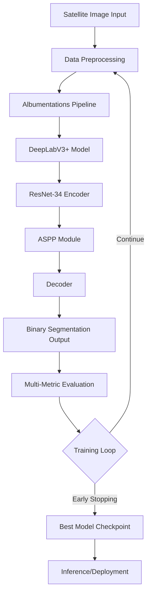

# Road Network Analysis

> A production-ready semantic segmentation system that extracts road networks from satellite imagery using state-of-the-art deep learning techniques.

---

### ✨ Key Features
- **DeepLabV3+ Architecture with Atrous Spatial Pyramid Pooling (ASPP):** Leverages dilated convolutions to capture multi-scale contextual information, essential for detecting roads of varying widths in satellite imagery.
- **Advanced Data Augmentation Pipeline:** Implements sophisticated augmentation strategies using Albumentations, including geometric transforms, photometric adjustments, and rotation, achieving robust model generalization across diverse geographic conditions.
- **Production-Grade Training Infrastructure:** Features early stopping, learning rate scheduling with ReduceLROnPlateau, comprehensive checkpointing, and multi-metric evaluation (Dice, IoU, Precision, Recall, F1) for rigorous model validation.
- **Dual Deployment Interface:** Provides both an interactive Streamlit dashboard for real-time inference and a modular CLI for batch processing and integration into existing workflows.
- **Configurable Architecture:** YAML-based configuration system enables seamless experimentation with different encoders (ResNet, EfficientNet), hyperparameters, and training strategies without code modification.

---

## 🚀 Technical Deep Dive

This section details the architecture, core algorithms, and technology choices that power this project.

### Architecture Overview



The system follows a **semantic segmentation pipeline** optimized for geospatial computer vision:

1. **Input Processing:** Satellite images are normalized and augmented using Albumentations, which provides GPU-accelerated transformations specifically designed for image segmentation tasks.

2. **Model Architecture:** DeepLabV3+ serves as the backbone, chosen for its exceptional performance in dense prediction tasks. The encoder (ResNet-34 by default, configurable to EfficientNet-B4) extracts hierarchical features, while the ASPP module captures multi-scale context through parallel dilated convolutions.

3. **Training Strategy:** The model is trained using Binary Cross-Entropy with Logits loss, optimized via Adam with weight decay for regularization. A ReduceLROnPlateau scheduler dynamically adjusts the learning rate based on validation Dice score, preventing overfitting while maintaining convergence speed.

4. **Evaluation & Deployment:** Comprehensive metrics (Dice coefficient, IoU, Precision, Recall, F1) ensure robust performance assessment. The trained model can be deployed via CLI for batch processing or through a Streamlit web interface for interactive use.

### Core Algorithms & Logic

**Semantic Segmentation with DeepLabV3+**

The core of this system is a **DeepLabV3+ architecture** implemented using `segmentation-models-pytorch`. This architecture was specifically chosen for several critical reasons:

- **Atrous Spatial Pyramid Pooling (ASPP):** Unlike traditional CNNs that lose spatial resolution through pooling, DeepLabV3+ employs dilated convolutions in the ASPP module to maintain resolution while expanding the receptive field. This is crucial for road detection, where roads can vary from narrow residential streets (few pixels wide) to major highways (hundreds of pixels wide).

- **Encoder-Decoder Structure:** The encoder (ResNet-34/EfficientNet-B4 pretrained on ImageNet) extracts robust feature representations, while the decoder progressively upsamples and refines predictions. The low-level features from the encoder are concatenated with decoder features, recovering fine spatial details critical for precise road boundary delineation.

- **Transfer Learning Strategy:** By leveraging ImageNet-pretrained encoders, the model starts with learned feature extractors that already understand edges, textures, and shapes—universal patterns applicable to satellite imagery. This significantly reduces training time and improves performance, especially with limited training data.

**Data Augmentation Pipeline**

The augmentation strategy is engineered to simulate real-world variations in satellite imagery:

```python
# From src/data_loader.py
A.Compose([
    A.Resize(512, 512),
    A.HorizontalFlip(p=0.5),          # Geographic invariance
    A.VerticalFlip(p=0.5),            # Geographic invariance
    A.RandomBrightnessContrast(p=0.2), # Lighting conditions
    A.Rotate(limit=15, p=0.3),        # Orientation variation
    A.Normalize(),
    ToTensorV2(),
])
```

This pipeline ensures the model generalizes across different:
- Geographic orientations (flips and rotations)
- Lighting conditions and weather (brightness/contrast adjustments)
- Image resolutions (resize with aspect ratio preservation)

**Multi-Metric Evaluation Framework**

The evaluation system employs five complementary metrics to assess different aspects of model performance:

- **Dice Coefficient:** Measures overlap between predicted and ground truth masks, prioritizing overall segmentation quality (harmonic mean of precision and recall).
- **IoU (Jaccard Index):** Stricter than Dice, penalizes both false positives and false negatives, essential for applications requiring precise boundary detection.
- **Precision:** Quantifies the accuracy of predicted road pixels—critical when false positives are costly (e.g., routing applications).
- **Recall:** Measures the model's ability to detect all road pixels—crucial for ensuring complete network coverage.
- **F1 Score:** Balanced metric considering both precision and recall, useful for comparing models holistically.

### Technology Stack & Rationale

| Category      | Technology                        | Justification                                                                 |
|---------------|-----------------------------------|-------------------------------------------------------------------------------|
| **Language**  | Python 3.8+                       | De facto standard for deep learning with extensive ecosystem and community support. |
| **Framework** | PyTorch 1.8+                      | Preferred for research and production due to dynamic computational graphs, intuitive debugging, and strong industry adoption. |
| **Model Library** | segmentation-models-pytorch   | Provides pre-trained implementations of 25+ segmentation architectures with 100+ encoders, enabling rapid experimentation. |
| **Augmentation** | Albumentations                 | GPU-accelerated, 3-5x faster than torchvision, with specialized transforms for segmentation tasks that preserve mask alignment. |
| **Visualization** | Matplotlib + OpenCV           | Matplotlib for publication-quality plots; OpenCV for efficient image I/O and preprocessing operations. |
| **Configuration** | PyYAML                        | Human-readable configuration management, enabling reproducible experiments and easy hyperparameter tuning. |
| **Deployment** | Streamlit                        | Rapid prototyping of interactive web interfaces with minimal frontend code, ideal for demos and stakeholder presentations. |
| **Optimization** | Adam with ReduceLROnPlateau   | Adam provides adaptive learning rates per parameter; ReduceLROnPlateau prevents overfitting by reducing LR when validation metrics plateau. |

---

## 🛠️ Getting Started

Instructions on how to set up and run the project locally.

### Prerequisites
- Python 3.8 or higher
- CUDA-capable GPU (optional but recommended; training falls back to CPU)
- 8GB+ RAM recommended for training
- ~2GB disk space for dependencies and checkpoints

### Installation & Setup

```bash
# 1. Clone the repository
git clone https://github.com/Zburgers/road-network-analysis.git
cd road-network-analysis

# 2. Create and activate a virtual environment (recommended)
python -m venv venv
source venv/bin/activate  # On Windows: venv\Scripts\activate

# 3. Install dependencies
pip install -r requirements.txt

# 4. Set up configuration
# Edit config.yaml to specify your dataset paths and hyperparameters
# Update the data paths to point to your training/validation datasets:
#   - data.train_images_dir: path/to/train/images
#   - data.train_masks_dir: path/to/train/masks
#   - data.val_images_dir: path/to/val/images
#   - data.val_masks_dir: path/to/val/masks
```

### Running the Application

#### Option 1: Training (Modular Approach)

```bash
# Train the model with configuration from config.yaml
python main.py --mode train

# The training loop will:
# - Load and augment your dataset
# - Train the DeepLabV3+ model
# - Save checkpoints to checkpoints/
# - Display progress bars and metrics
# - Apply early stopping when validation metrics plateau
```

#### Option 2: Evaluation

```bash
# Evaluate a trained model on the validation set
python main.py --mode evaluate

# This will load the best checkpoint and report:
# - Dice Score
# - IoU (Intersection over Union)
# - Precision, Recall, F1 Score
```

#### Option 3: Interactive Notebook

```bash
# Launch Jupyter Notebook for exploratory analysis
jupyter notebook main.ipynb

# The notebook provides:
# - Step-by-step training visualization
# - Data exploration and augmentation preview
# - Interactive hyperparameter tuning
# - Real-time prediction visualization
```

#### Option 4: Streamlit Dashboard (Inference)

```bash
# Launch the interactive web interface
streamlit run streamlit-dashboard/app.py

# Upload satellite images and visualize road predictions in real-time
```

---

## 💻 Code Snippet Showcase

The following snippet from `src/train.py` demonstrates the **training loop with sophisticated metric tracking and checkpointing logic**. This design pattern ensures training can be resumed from any point, implements early stopping to prevent overfitting, and tracks multiple metrics simultaneously for comprehensive model evaluation.

```python
# Core training loop with early stopping and multi-metric validation
for epoch in range(start_epoch, config['train']['epochs']):
    model.train()
    epoch_loss = 0.0
    loop = tqdm(train_loader, desc=f"Epoch [{epoch+1}/{config['train']['epochs']}]")

    for images, masks in loop:
        images, masks = images.to(device), masks.to(device)
        
        optimizer.zero_grad()
        outputs = model(images)
        loss = criterion(outputs, masks)
        loss.backward()
        optimizer.step()
        
        epoch_loss += loss.item()
        loop.set_postfix(loss=loss.item())

    # Validation with comprehensive metrics
    val_metrics = evaluate_model(model, val_loader, device)
    scheduler.step(val_metrics['dice'])  # LR reduction on plateau

    # Save best model based on Dice score
    if val_metrics['dice'] > best_metrics['dice']:
        best_metrics = val_metrics
        save_checkpoint(model, optimizer, epoch, best_metrics, config, best=True)
        patience_counter = 0
    else:
        patience_counter += 1

    # Early stopping to prevent overfitting
    if patience_counter >= max_patience:
        print(f"🛑 Early stopping triggered. Best Dice: {best_metrics['dice']:.4f}")
        break
```

**Why this approach?**

1. **Resilience:** Checkpointing both "last" and "best" models ensures training can resume after interruptions and preserves the optimal weights even if training continues past the best epoch.

2. **Efficiency:** Early stopping halts training when validation metrics stop improving, saving computational resources and preventing overfitting.

3. **Observability:** Progress bars with real-time loss updates and comprehensive metric logging (Dice, IoU, Precision, Recall, F1) provide full transparency into model behavior.

4. **Adaptive Learning:** The ReduceLROnPlateau scheduler automatically reduces the learning rate when Dice score plateaus, enabling the model to fine-tune and escape local minima.

---

## 📊 Project Structure

```
road-network-analysis/
├── src/
│   ├── model.py           # DeepLabV3+ architecture definition
│   ├── train.py           # Training loop with early stopping
│   ├── evaluate.py        # Multi-metric evaluation (Dice, IoU, F1, etc.)
│   ├── data_loader.py     # Custom dataset with Albumentations pipeline
│   └── utils.py           # Checkpointing, visualization, seed setting
├── streamlit-dashboard/
│   ├── app.py             # Streamlit web interface for inference
│   └── utils.py           # Prediction and visualization helpers
├── main.py                # CLI entry point (train/evaluate modes)
├── main.ipynb             # Jupyter notebook for interactive exploration
├── config.yaml            # Centralized configuration (hyperparameters, paths)
├── requirements.txt       # Python dependencies
└── README.md              # This file
```

---

## 🎯 Future Roadmap

- [ ] **Post-Processing with CRF:** Implement Conditional Random Fields to refine segmentation boundaries and reduce noise in predictions.
- [ ] **Multi-Scale Inference:** Average predictions at multiple image scales to improve robustness and accuracy.
- [ ] **Graph Extraction:** Convert binary segmentation masks to vector graphs representing road networks, enabling downstream applications like route planning.
- [ ] **Data Augmentation Evolution:** Integrate advanced techniques like MixUp, CutMix, or test-time augmentation for improved generalization.
- [ ] **Model Ensemble:** Combine predictions from multiple architectures (e.g., DeepLabV3+, UNet++, HRNet) to boost performance.
- [ ] **Deployment Optimization:** Implement ONNX export and TensorRT optimization for low-latency inference on edge devices.
- [ ] **Continuous Learning:** Design a feedback loop where user corrections are incorporated to fine-tune the model over time.
- [ ] **Multi-Class Segmentation:** Extend to classify different road types (highways, residential streets, unpaved roads) for richer semantic understanding.

---

## 📝 Configuration

Key parameters in `config.yaml`:

```yaml
model:
  encoder: resnet34              # Encoder backbone: resnet34, resnet50, efficientnet-b4, etc.
  pretrained: true               # Use ImageNet pre-trained weights
  
data:
  train_images_dir: path/to/train/images
  train_masks_dir: path/to/train/masks
  val_images_dir: path/to/val/images
  val_masks_dir: path/to/val/masks
  image_size: 512                # Input resolution (512x512)
  batch_size: 4                  # Adjust based on GPU memory (reduce if OOM)
  num_workers: 4                 # Parallel data loading threads
  augmentations: true            # Enable data augmentation
  
train:
  epochs: 50
  learning_rate: 1e-4            # Adam learning rate
  weight_decay: 1e-5             # L2 regularization strength
  early_stopping_patience: 10    # Stop after N epochs without improvement
  checkpoint_dir: checkpoints    # Directory to save model checkpoints
  seed: 42                       # Random seed for reproducibility
  device: cuda                   # 'cuda' or 'cpu'
```

**Note:** The code expects `model.encoder` and `model.pretrained` keys. If your config uses different key names (e.g., `encoder_name`, `encoder_weights`), update `src/model.py` accordingly.

Modify these parameters to experiment with different configurations and optimize for your specific dataset.

---

## 🤝 Contributing

Contributions are welcome! To contribute:

1. Fork the repository
2. Create a feature branch (`git checkout -b feature/amazing-feature`)
3. Commit your changes (`git commit -m 'Add amazing feature'`)
4. Push to the branch (`git push origin feature/amazing-feature`)
5. Open a Pull Request

Please ensure your code follows PEP 8 style guidelines and includes appropriate documentation.

---

## 📄 License

This project is licensed under the MIT License - see the LICENSE file for details.

---

## 🙏 Acknowledgments

- **segmentation-models-pytorch:** Pavel Yakubovskiy for the excellent segmentation library
- **Albumentations:** Fast and flexible augmentation library by the Albumentations team
- **PyTorch:** The PyTorch team for providing a powerful deep learning framework


